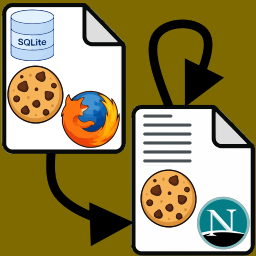

<h3> <code>cookies_from_browser_firefox</code></h3>

The input can be either:
- a firefox `cookies.sqlite` database (or a compatible sqlite file, `moz_cookies` table and `host`, `path`, `isSecure`, `isHttpOnly`, `expiry`, `name`, `value` columns).
- a `Netscape`-format cookie text file.

note:  
The input type is detected from the first `16` bytes.  
SQLite databases begin with `SQLite format 3\0`  
all other files are treated as text-based `Netscape` cookie files.

output is always written in `Netscape` cookie-file format.




<hr/>

online docs. : https://eladkarako.github.io/cookies_from_browser_firefox/  

<hr/>

### yt-dlp

this program can be used instead of `yt-dlp`'s `--cookies-from-browser`,  
just for Firefox with an explicit path to the `cookies.sqlite`,  

the result text content, when written to file, can be used with `yt-dlp`'s `--cookies` .

you can keep just the host names you actually need by providing (for example)
`--include=google` `--include=youtube`

you can also pass through an already exported file just for filtering.  

so you won't need to use grep or stuff such as 

```cmd
set FILTER=/c:"^\.youtube" /c:"^\.google" /c:"^consent\.youtube" /c:"consent\.google"
type "mycookies.txt" | findstr /i /r %FILTER%>>"%~sdp1%~n1_filtered.txt" >filtered_cookies.txt
```

as it works extremely fast, and in parallel, it can save you few seconds as well as post-processing,  
since you don't really need to hold all your browser's cookies in a file (that's not very secure..). 

<hr/>

## Examples

<br/>

### process a firefox database without filters, this will have all cookies:

```
cookies_from_browser_firefox
--path "/path/to/cookies.sqlite"
> cookies.txt
```

<hr/>

### include ONLY hosts containing either partial text of `example` or `mozilla` in the host name (not case-sensitive):

```
cookies_from_browser_firefox
--path cookies.sqlite
--include example
--include mozilla
> filtered.txt
```

<hr/>

### exclude hosts containing either `ads` or `tracker`:

```
cookies_from_browser_firefox
--path cookies.sqlite
--exclude ads
--exclude tracker
> filtered.txt
```

<hr/>

### combine include and exclude filters:

```
cookies_from_browser_firefox
--path cookies.sqlite
--include example
--include test
--exclude ads
--exclude tracking
> filtered.txt
```


<hr/>

`Secure` and `HttpOnly` are handled independently:

`#HttpOnly_.example.com	TRUE	/	TRUE	1893456000	session	abc123`

This record has:

- `HttpOnly = true, from #HttpOnly_`
- `Secure = true, from the fourth field`
- `include_subdomains` = true, from the leading dot in `.example.com`


<hr/>
<hr/>
<hr/>

- `tokio`-based, multi-reader, parallel extraction (multiple blocking worker threads).
- waits for every worker to finish.
- merges all records in the coordinating task.
- sorts by `host` (ignoring a leading `.` just for sorting so similar hosts would be grouped together), then by `path`, then by  `name`.
- outputs a plain text (`STDOUT`) compatible with netscape-format cookie file (ASCII safe).
- adds a descriptive header.

<hr/>

this tool was programmed with the assistance of two agent actually, CoPilot (lite), and Claude `Haiku 4.5`, and JetBrains RustRover community.  

<hr/>

<details><summary>notes - build related</summary

### build - semi-automatic

`__01_build_releases.cmd` followed by `__02_repack_binary.cmd` will build and zip (needs `7z.exe` in system's `PATH`) the single-file binaries. `version.txt` and `changelog.txt` may be added manually.  

note that the first batch-file also launches wsl and tries to run the build commands.

it always tries to update everything. but it still needs you to install OS toolchain dependencies.

### build - manual

```
rustup update

cargo clean

#note: visual-studio community with C++ development needs to be installed.
rustup target add   x86_64-pc-windows-msvc   i686-pc-windows-msvc
cargo build  --release  --target   x86_64-pc-windows-msvc
cargo build  --release  --target   i686-pc-windows-msvc

#note: that .cargo/config.toml uses specific linker from Android Studio on Windows - paths needs adjustments!
rustup target add   x86_64-linux-android   i686-linux-android   aarch64-linux-android   armv7-linux-androideabi
cargo build  --release  --target   x86_64-linux-android
cargo build  --release  --target   i686-linux-android
cargo build  --release  --target   aarch64-linux-android
cargo build  --release  --target   armv7-linux-androideabi

#note: you'll need apt-get dependencies. and 'aarch64-unknown-linux-musl' uses linker with custom toolchain - paths needs adjustments!.
#sudo apt-get update && sudo apt-get upgrade && sudo apt-get install --yes android-sdk-libsparse-utils apt-fast apt-transport-https aptitude aria2 asciidoc autoconf automake autopoint autotools-dev base-files bash bash-completion binutils binutils-aarch64-linux-gnu binutils-aarch64-linux-gnu-dbg binutils-alpha-linux-gnu binutils-alpha-linux-gnu-dbg binutils-arc-linux-gnu binutils-arc-linux-gnu-dbg binutils-arm-linux-gnueabi binutils-arm-linux-gnueabi-dbg binutils-arm-linux-gnueabihf binutils-arm-linux-gnueabihf-dbg binutils-arm-none-eabi binutils-avr binutils-bpf binutils-common binutils-dev binutils-djgpp binutils-doc binutils-for-build binutils-for-host binutils-h8300-hms binutils-hppa64-linux-gnu binutils-hppa64-linux-gnu-dbg binutils-hppa-linux-gnu binutils-hppa-linux-gnu-dbg binutils-i686-gnu binutils-i686-gnu-dbg binutils-i686-kfreebsd-gnu binutils-i686-kfreebsd-gnu-dbg binutils-i686-linux-gnu binutils-i686-linux-gnu-dbg binutils-ia64-linux-gnu binutils-ia64-linux-gnu-dbg binutils-loongarch64-linux-gnu binutils-loongarch64-linux-gnu-dbg binutils-m68hc1x binutils-m68k-linux-gnu binutils-m68k-linux-gnu-dbg binutils-mingw-w64 binutils-mingw-w64-i686 binutils-mingw-w64-x86-64 binutils-mips64-linux-gnuabi64 binutils-mips64-linux-gnuabi64-dbg binutils-mips64-linux-gnuabin32 binutils-mips64-linux-gnuabin32-dbg binutils-mips64el-linux-gnuabi64 binutils-mips64el-linux-gnuabi64-dbg binutils-mips64el-linux-gnuabin32 binutils-mips64el-linux-gnuabin32-dbg binutils-mips-linux-gnu binutils-mips-linux-gnu-dbg binutils-mipsel-linux-gnu binutils-mipsel-linux-gnu-dbg binutils-mipsisa32r6-linux-gnu binutils-mipsisa32r6-linux-gnu-dbg binutils-mipsisa32r6el-linux-gnu binutils-mipsisa32r6el-linux-gnu-dbg binutils-mipsisa64r6-linux-gnuabi64 binutils-mipsisa64r6-linux-gnuabi64-dbg binutils-mipsisa64r6-linux-gnuabin32 binutils-mipsisa64r6-linux-gnuabin32-dbg binutils-mipsisa64r6el-linux-gnuabi64 binutils-mipsisa64r6el-linux-gnuabi64-dbg binutils-mipsisa64r6el-linux-gnuabin32 binutils-mipsisa64r6el-linux-gnuabin32-dbg binutils-msp430 binutils-multiarch binutils-multiarch-dbg binutils-multiarch-dev binutils-or1k-elf binutils-powerpc64-linux-gnu binutils-powerpc64-linux-gnu-dbg binutils-powerpc64le-linux-gnu binutils-powerpc64le-linux-gnu-dbg binutils-powerpc-linux-gnu binutils-powerpc-linux-gnu-dbg binutils-riscv64-linux-gnu binutils-riscv64-linux-gnu-dbg binutils-riscv64-unknown-elf binutils-s390x-linux-gnu binutils-s390x-linux-gnu-dbg binutils-sh4-linux-gnu binutils-sh4-linux-gnu-dbg binutils-sh-elf binutils-source binutils-sparc64-linux-gnu binutils-sparc64-linux-gnu-dbg binutils-x86-64-gnu binutils-x86-64-gnu-dbg binutils-x86-64-kfreebsd-gnu binutils-x86-64-kfreebsd-gnu-dbg binutils-x86-64-linux-gnu binutils-x86-64-linux-gnu-dbg binutils-x86-64-linux-gnux32 binutils-x86-64-linux-gnux32-dbg binutils-xtensa-lx106 binutils-z80 binwalk bison bsdutils build-essential ca-certificates ccache checkinstall clang clisp-module-zlib cmake cmake-curses-gui cmake-data cmake-doc cmake-extras cmake-fedora cmake-format cmake-qt-gui cmake-vala coreutils curl dash debianutils devscripts dh-autoreconf diffutils docbook2x docbook-xsl docker.io dos2unix doxygen doxygen2man doxygen-awesome-css doxygen-doc doxygen-doxyparse doxygen-gui doxygen-latex dpkg-dev dpkg-dev-el elpa-dpkg-dev-el erlang-p1-zlib erofs-utils erofsfuse expat f2fs-tools findutils flex fuse2fs g++ g++-mingw-w64 g++-mingw-w64-i686 g++-mingw-w64-x86-64 gambas3-gb-compress-bzlib2 gambas3-gb-compress-zlib gcc gcc-aarch64-linux-gnu gcc-arm-linux-gnueabihf gcc-i686-linux-gnu gcc-mingw-w64 gcc-mingw-w64-i686 gcc-mingw-w64-x86-64 gcc-powerpc64-linux-gnu gcc-powerpc64le-linux-gnu gcc-powerpc-linux-gnu gcc-riscv64-linux-gnu gdb-mingw-w64 gedit gettext gfortran-mingw-w64 git glibc-doc glibc-doc-reference glibc-source glibc-tools gnat-mingw-w64 gnome-terminal gobjc-mingw-w64 gobjc++-mingw-w64 golang gperf grep gtk-doc-tools guile-lzlib guile-zlib gyp gzip hostname init intltool libassuan-mingw-w64-dev libattr1 libc6-dev libc6-dev-amd64-cross libc6-dev-amd64-i386-cross libc6-dev-amd64-x32-cross libc6-dev-arm64-cross libc6-dev-armhf-cross libc6-dev-i386 libc6-dev-powerpc-cross libc6-dev-powerpc-ppc64-cross libc6-dev-riscv64-cross libc-ares-dev libc++1 libc++abi1 libcompress-raw-zlib-perl libcppunit-dev libcurl4-openssl-dev libdpkg-dev libdwarf-dev libelf-dev libevent-2.1-7t64 libevent-core-2.1-7t64 libevent-dev libevent-distributor-perl libevent-execflow-perl libevent-extra-2.1-7t64 libevent-openssl-2.1-7t64 libevent-perl libevent-pthreads-2.1-7t64 libevent-rpc-perl libexpat1-dev libexpat-ocaml libexpat-ocaml-dev libffi-dev libfuse3-dev libgcrypt20-dev libgcrypt-mingw-w64-dev libghc-bzlib-dev libghc-bzlib-doc libghc-bzlib-prof libghc-zlib-bindings-dev libghc-zlib-bindings-doc libghc-zlib-bindings-prof libghc-zlib-dev libghc-zlib-doc libghc-zlib-prof libgmp-dev libgnatcoll-zlib3 libgnatcoll-zlib-dev libgnutls28-dev libgpg-error-mingw-w64-dev libguestfs-tools libjansson-dev libjzlib-java libksba-mingw-w64-dev libmpc-dev libmpfr-dev libncurses-dev libnpth-mingw-w64-dev libp11-kit-dev librte-compress-zlib24 libruby3.2 librust-async-compression-dev librust-expat-sys-dev librust-flate2-dev librust-gix-features-dev librust-grcov-dev librust-harfbuzz-sys-dev librust-khronos-egl-dev librust-libsodium-sys-dev librust-libsqlite3-sys-dev librust-libz-sys-dev librust-oxrocksdb-sys-dev librust-pkg-config-dev librust-pq-sys-dev librust-smithay-client-toolkit-dev librust-zip-dev librust-zstd-dev librust-zstd-safe-dev librust-zstd-sys-dev libsgmls-perl libsqlite3-dev libssh2-1-dev libssl-dev libtasn1-6-dev libtool libtool-bin libudev-dev libunistring-dev libxml2-dev libxml-sax-expat-incremental-perl libxml-sax-expatxs-perl libz-mingw-w64 libz-mingw-w64-dev lld llvm-dev login lua-expat lua-expat-dev lua-zlib lua-zlib-dev lzip m4 make mercurial mingw-w64 mingw-w64-common mingw-w64-i686-dev mingw-w64-tools mingw-w64-x86-64-dev musl musl-dev musl-tools nasm nautilus ncurses-base ncurses-bin nettle-dev ninja-build node-browserify-zlib npm openjdk-17-jdk openssh-server p7zip-full p11-kit-doc patch perl pkg-config pkgconf plocate pv python3 python3-colcon-pkg-config python3-docutils python3-jsonschema python3-mako python3-mesonpy python3-pip python3-requests python3-rstr python3-sphinx python-is-python3 r-bioc-zlibbioc ragel re2c ruby-pkg-config screen sed sgml-base sgml-base-doc sgml-data sgml-spell-checker sgmls-doc sgmlspl slang-expat software-properties-common subversion texinfo tree ubuntu-minimal ubuntu-wsl unzip util-linux uuid-dev wget win-iconv-mingw-w64-dev xmlto xsltproc yasm zlib1g-dev
rustup target add   x86_64-unknown-linux-gnu   aarch64-unknown-linux-gnu   x86_64-unknown-linux-musl   aarch64-unknown-linux-musl  powerpc-unknown-linux-gnu  powerpc64-unknown-linux-gnu  powerpc64le-unknown-linux-gnu
cargo build  --release  --target   x86_64-unknown-linux-gnu
cargo build  --release  --target   aarch64-unknown-linux-gnu
cargo build  --release  --target   x86_64-unknown-linux-musl
cargo build  --release  --target   aarch64-unknown-linux-musl
cargo build  --release  --target   powerpc-unknown-linux-gnu
cargo build  --release  --target   powerpc64-unknown-linux-gnu
cargo build  --release  --target   powerpc64le-unknown-linux-gnu
```

### build Docs.

`cargo doc --no-deps --document-private-items --release --open`  

### code format

`rustfmt.toml` in the project's root 
- to just check use `cargo fmt -- --check` to just check.
- to auto-format use `cargo fmt`
- `rustfmt --print-config default` to see all default.  

### linker notes

`.cargo/config.toml` - has in-notes, and there are some notes above in the manual build part.  
basically it points to a toolchain - gcc triplet in linux, in `PATH` or custom folder, android ndk folder in (my) windows,  
and adds few useful stuff, for windows x32 binaries, it modifies a flag that forbid accessing more than 2g of RAM,  

### `Cargo.toml` - `[profile.release]`

there are few optimizations for when using `--release`,  
mostly crates are joined inline first, debug symbols is stripped away,  
and trying to reduce the binary size by omitting stuff that were not used.  


</details>

<br/>


Feel free to open an issue or ask a question.

<a href="https://paypal.me/31adkarak0" target="_blank" rel="noopener noreferrer">
  
  <br />
  
</a>

<br/>
<hr/>
<br/>